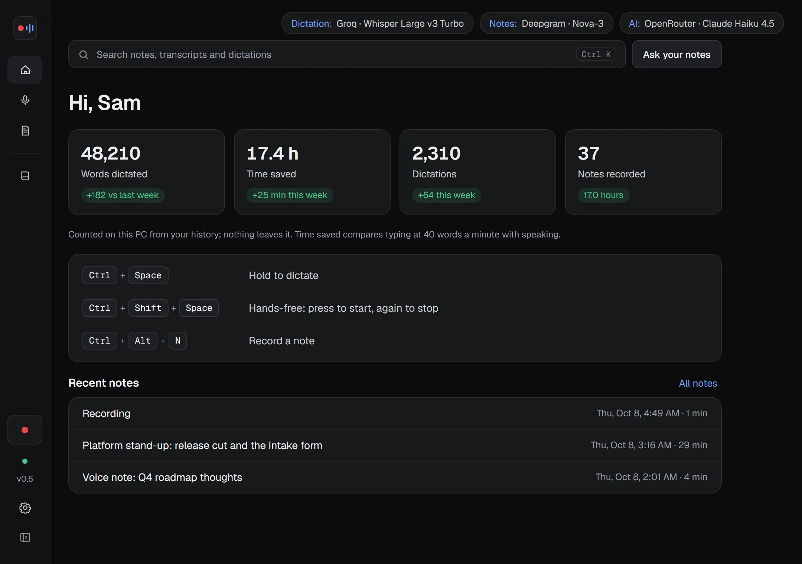
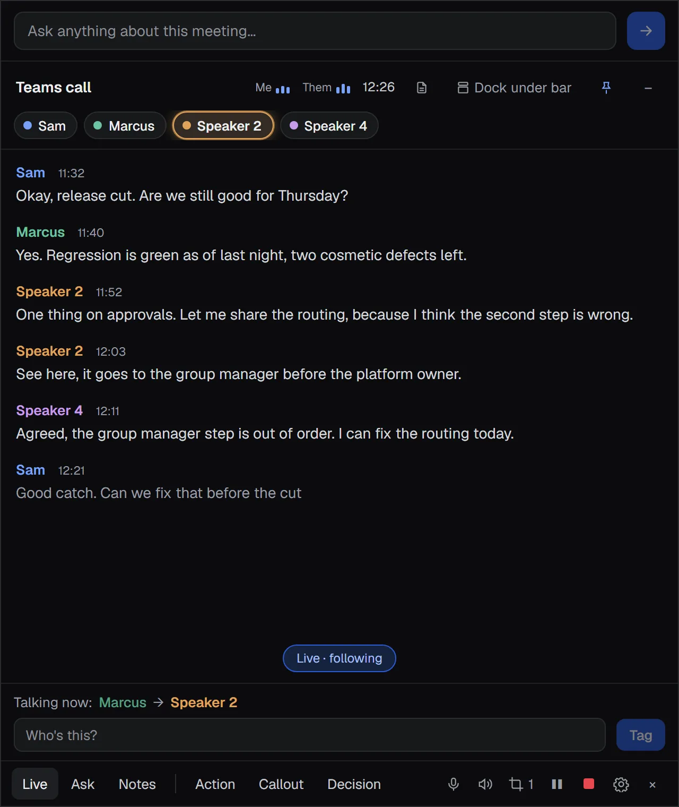
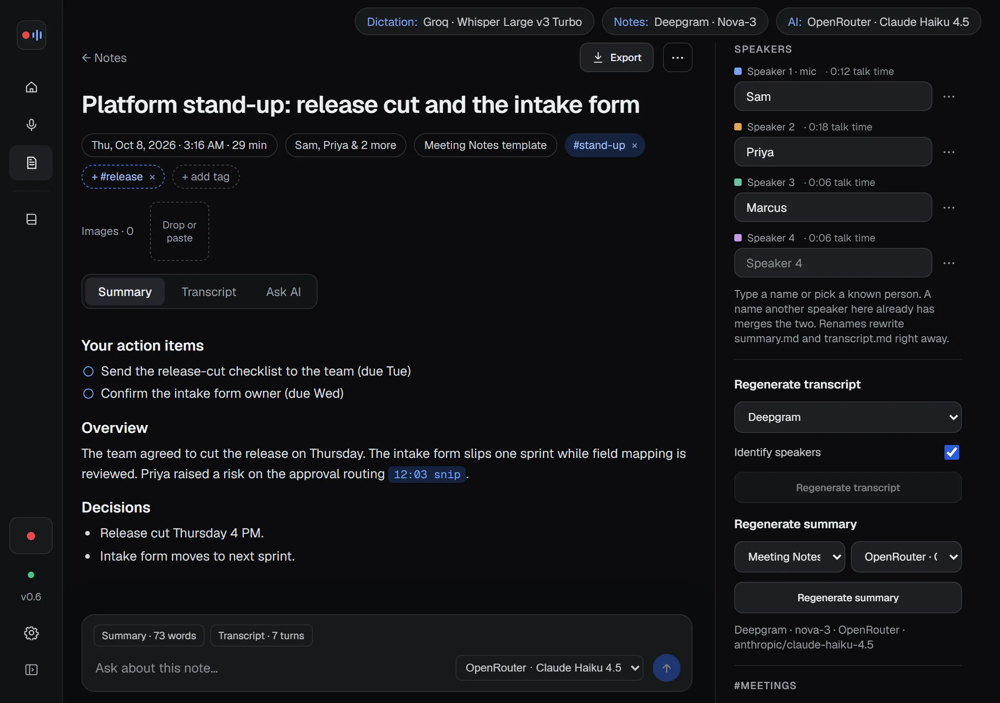

<h1 align="center">
  <picture>
    <source media="(prefers-color-scheme: dark)" srcset="docs/lockup-dark.svg">
    
  </picture>
</h1>

<b>Hold a key and talk. Join a call and know who's talking.</b> Dictation and meeting notes for Windows. No bot in your meeting. Runs on your PC or with your own keys.

  <a href="https://github.com/atlas9-ai/a9voice-releases/releases/latest/download/A9Voice-Setup-x64.exe"><b>Download for Windows</b></a> ·
  <a href="https://a9voice.com">Website</a> ·
  <a href="https://a9voice.com/docs/">Manual</a> ·
  <a href="https://a9voice.com/changelog/">Changelog</a> ·
  <a href="https://a9voice.com/docs/privacy-and-data/">Privacy</a> ·
  <a href="https://github.com/atlas9-ai/a9voice-releases/issues/new/choose">Report an issue</a>

A9 Voice is an early preview for Windows 10 and 11 (64-bit), free during the preview. It has two parts:

- **Transcribe:** hold a key in any app, talk, let go. The words appear where your cursor is.
- **Notes:** records meetings, videos and voice notes from your mic and your computer's audio. No bot joins the call.

## What it does

- **Works offline, or with your own keys.** Run speech models on your PC with no key and no internet, or use the speech and AI providers you pick and pay them directly.
- **Uses your graphics card (new in 0.6, optional).** Any DirectX 12 card, any brand, can run the bigger Whisper models, much faster than the processor on a modern graphics card. If the card has a problem, A9 Voice finishes on the processor.
- **Knows who's talking.** A live transcript with a chip per speaker. Tag a voice once and every line gets the name. Voice recognition is opt-in, and voiceprints stay on your PC.
- **Search and Ask.** Press Ctrl+K to search every note; ask a question and get an answer with links to the exact moment.
- **A connector for Claude and ChatGPT.** Let your AI assistant search and read your notes. Read only, and off until you turn it on.
- **Summaries, templates and exports.** Your action items first. Export to Markdown, text, PDF, Word, HTML email or captions, with your logo if you like.
- **Webhooks.** Send each finished note to n8n, Zapier, Make, Discord, Slack or Telegram.
- **Plain files.** Every note is a folder of Markdown on your PC.

 

## Install

1. [Download the installer](https://github.com/atlas9-ai/a9voice-releases/releases/latest/download/A9Voice-Setup-x64.exe) and run it. It installs for your Windows user only: no admin rights.
2. Windows may say it "protected your PC", because the installer isn't code-signed yet. Click **More info**, then **Run anyway**. You see this once.
3. Follow the first-run steps, then see [Getting started](https://a9voice.com/docs/getting-started/).

Everything else (every screen, every setting, webhooks, troubleshooting) is in the [manual](https://a9voice.com/docs/).

## License

A9 Voice is proprietary software, free for personal use during the preview. See [LICENSE](LICENSE).
The website is © Atlas9 LLC, all rights reserved.

---

© 2026 Atlas9 LLC. Geist and Geist Mono are used under the SIL Open Font License.
